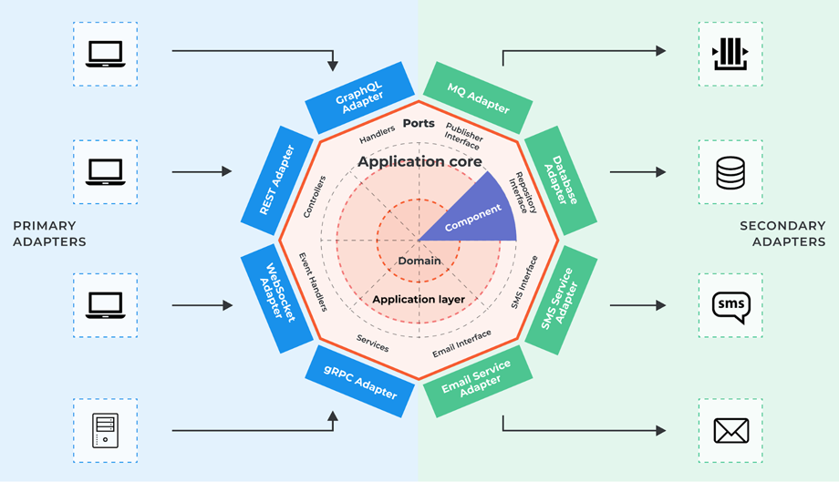

# Exchange connector

I used Hexagonal Architecture for easy functionality extension and to facilitate code modifications.

Used Abstractions:

- `Domain` (could be named `models` or `entities`): This layer contains the business logic, **for example OrderBook**.
- `Ports` (could be named `interfaces` or `api`): Contracts for connecting new adapters, **such as new exchanges**.
- `Adapters` (which can include `delegates`, `repositories`, `handlers`): This layer interacts with the external world. **You need to add new exchanges here**. In a real big project, exchange implementations would be placed in a subfolder called `delegates`.

